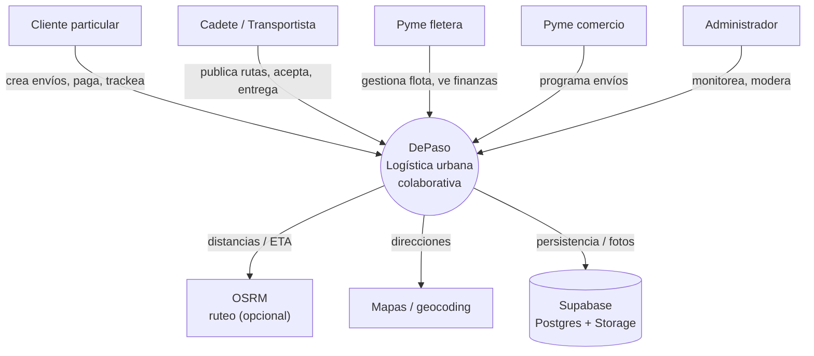
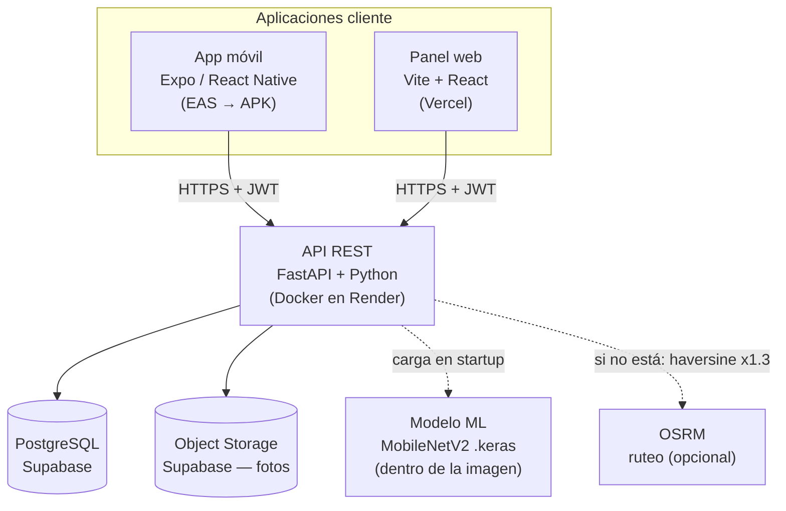
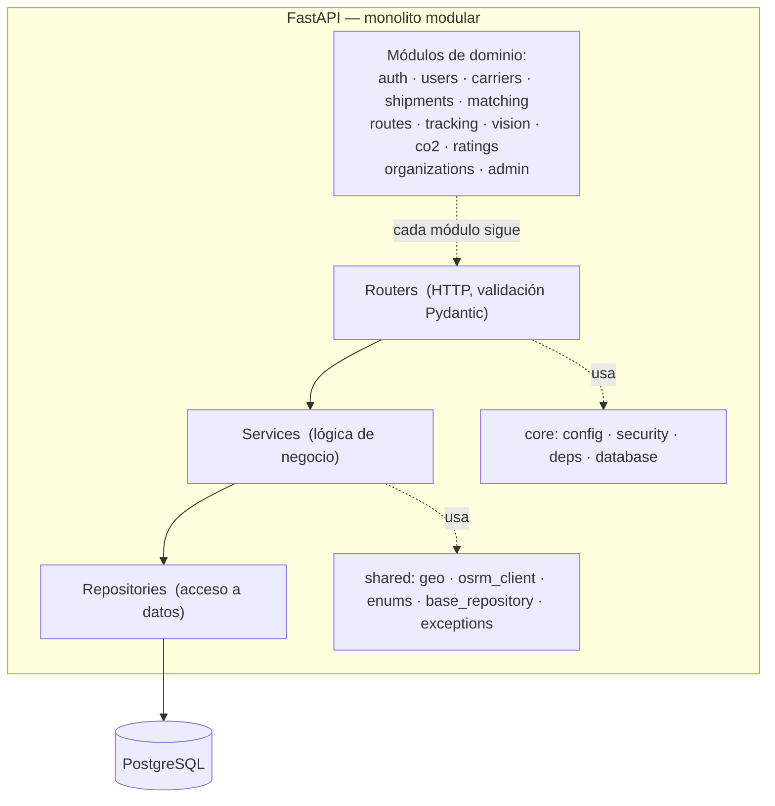
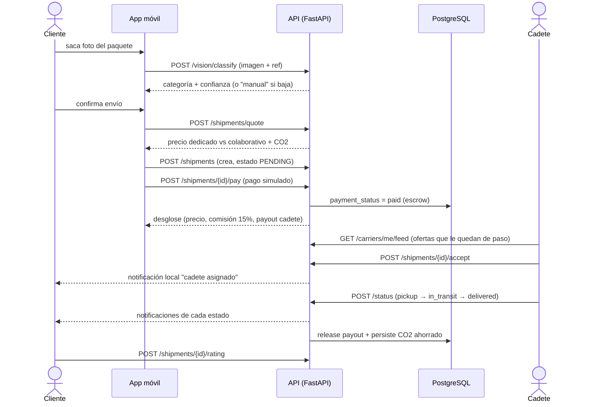
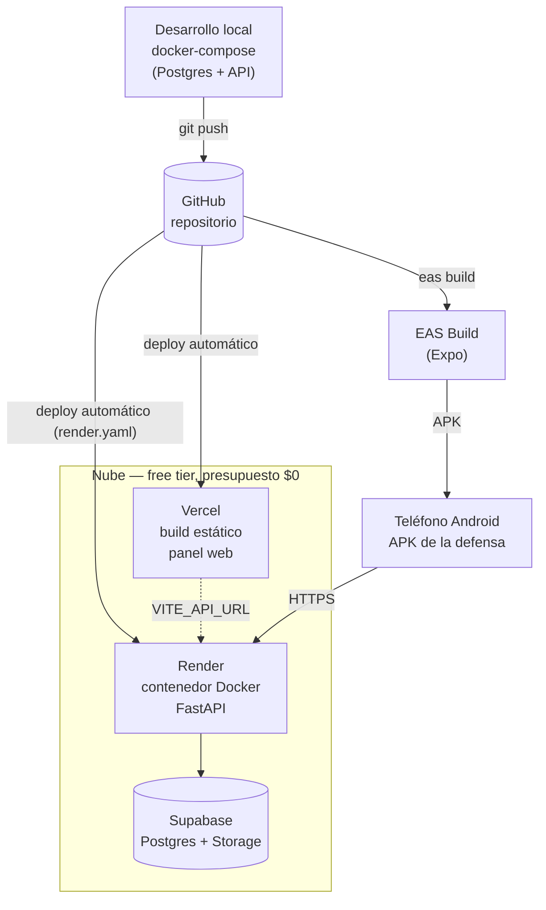

# DePaso — Diagramas de arquitectura + justificación de infraestructura

Diagramas en **Mermaid** (se renderizan solos en GitHub y en VS Code con la extensión
*Markdown Preview Mermaid*). Para exportar a PNG/SVG y pegar en la tesis: copiá el bloque en
[mermaid.live](https://mermaid.live) → *Actions → PNG/SVG*.

Están ordenados de mayor a menor abstracción (modelo **C4**: Contexto → Contenedores →
Componentes), más un diagrama de secuencia del caso de uso central y el diagrama de despliegue.
La justificación de infra (Terraform/Jenkins/CI-CD y buenas prácticas) está al final.

---

## 1. Nivel alto — Contexto del sistema (C4 nivel 1)

*Quién usa DePaso y de qué depende, tratando el sistema como una caja negra.*

**Para defender:** el sistema atiende a 5 tipos de usuario con dos frentes (app móvil para
cliente/cadete, panel web para pyme/admin) sobre un único backend. Las dependencias externas son
mínimas y todas reemplazables (ruteo tiene fallback, storage/DB son estándar).

---

## 2. Nivel medio — Contenedores (C4 nivel 2)

*Las unidades desplegables por separado y cómo se comunican.*

**Para defender:** es un **monolito modular** (una sola API) + apps cliente + DB gestionada. No hay
microservicios porque no hay razón para pagar su complejidad (red, observabilidad distribuida,
consistencia) en un MVP de una persona. El modelo ML viaja dentro de la imagen (~15 MB, se carga
una vez); si falta, la API sigue con un fallback determinístico.

---

## 3. Nivel bajo — Componentes del backend (C4 nivel 3)

*Cómo está organizado internamente el backend: modular por dominio + 4 capas.*

**Para defender:** cada módulo es autocontenido (`router → service → repository → schemas → models`),
lo que da límites claros y testeabilidad (100 tests). Es un monolito, pero **modularizado como si
fueran servicios**: si algún día hay que extraer uno (p. ej. `vision` o `matching`) la costura ya
existe. Patrón repositorio = la lógica no depende de SQLAlchemy directamente.

---

## 4. Diagrama de secuencia — caso de uso central

*Envío colaborativo de punta a punta: foto → clasificación → creación → pago → matching → entrega.*

**Para defender:** muestra cómo se integran los 3 pilares del proyecto (visión, matching, CO2) en un
flujo real, más el modelo de dinero (escrow con comisión) y las notificaciones. El polling (feed,
tracking) reemplaza a WebSockets/push — decisión documentada.

---

## 5. Diagrama de despliegue — topología de infraestructura

*Dónde corre físicamente cada cosa y cómo se despliega (CI/CD).*

**Para defender:** un push a GitHub dispara el deploy del backend (Render lee `render.yaml`) y del
panel (Vercel). El APK se genera con EAS. No hay servidores que administrar: todo es *platform as a
service* en free tier. Migrar de proveedor = cambiar dónde corre el mismo contenedor Docker, no el
código (portabilidad, RNF-PRT-02).

---

## 6. ¿Terraform? ¿Jenkins? ¿Qué buenas prácticas requiere el MVP?

Respuesta corta: **no necesitás Terraform ni Jenkins.** Sí necesitás un conjunto de buenas
prácticas que el proyecto **ya cumple** con herramientas más livianas. El criterio académico correcto
no es "usar la herramienta más grande", sino **elegir la mínima que resuelve el problema** y saber
justificar por qué las otras serían sobre-ingeniería a esta escala (principio YAGNI).

### 6.1 Herramienta por herramienta

| Herramienta | Para qué sirve | ¿La necesita el MVP? | Qué usamos en su lugar | Cuándo sí conviene |
|---|---|---|---|---|
| **Terraform** (IaC) | Provisionar infra cloud de forma declarativa, versionada y reproducible entre entornos | **No** | `render.yaml` (blueprint declarativo de Render) + `docker-compose.yml` + `Dockerfile` + `.env.example` ya son "infra como código" para lo que hay | Multi-entorno (dev/stage/prod) o multi-cloud provisionados repetidamente; equipos que recrean infra seguido |
| **Jenkins** (CI server self-hosted) | Orquestar pipelines de build/test/deploy en un servidor propio | **No** | Deploy automático de Render/Vercel al hacer `git push` + (opcional) **GitHub Actions** para tests/lint | Organización con muchos pipelines, agentes propios, o requisitos on-premise |
| **Kubernetes** | Orquestar muchos contenedores con réplicas/autoscaling | **No** | Un contenedor en Render | Muchos servicios, alta demanda, equipo de ops (ver ARQUITECTURA §4) |
| **Ansible** (config management) | Configurar servidores (VMs) de forma idempotente | **No** | No hay servidores que configurar: PaaS gestionado | Flota de VMs propias |
| **Docker** | Empaquetado reproducible y portable | **Sí ✅** | Ya está (`Dockerfile` multi-stage) | Siempre — es lo que da portabilidad |
| **GitHub Actions** | CI liviano (correr tests + lint en cada push/PR) | **Recomendado, opcional** | Hoy se corre local; un workflow lo automatiza | Es la única adición de "buena práctica" que realmente suma acá |

### 6.2 El argumento de fondo (para la defensa)

- **Terraform resuelve un problema que DePaso no tiene.** Su valor es *reproducibilidad y versionado
  de infraestructura que se crea muchas veces*. Acá la infra es 1 servicio + 1 base + 1 sitio
  estático, creados **una vez** desde un blueprint (`render.yaml`) que ya está versionado en el repo.
  Meter Terraform agregaría estado remoto, providers y una capa de herramientas para gestionar tres
  recursos que casi no cambian: costo sin beneficio. Se documenta como el camino si el proyecto
  creciera a múltiples entornos.
- **Jenkins es un servidor que habría que hostear y mantener** — introduce la misma clase de trabajo
  operativo que estamos evitando al usar PaaS. El CI/CD ya existe de dos formas: (1) Render y Vercel
  **deployan solos** ante un push (continuous deployment), y (2) opcionalmente un workflow de GitHub
  Actions corre la suite de tests y el linter en cada PR (continuous integration). Eso cubre CI/CD
  completo con cero infraestructura propia.
- **"Buenas prácticas" ≠ "más herramientas".** A nivel MVP/tesis, las buenas prácticas de DevOps que
  importan son: build reproducible, configuración fuera del código, migraciones versionadas, tests
  automatizados, secretos fuera del repo y un procedimiento de deploy documentado. Todo eso ya está.

### 6.3 Buenas prácticas que el MVP SÍ cumple (con evidencia en el repo)

| Buena práctica | Cómo se cumple en DePaso |
|---|---|
| Control de versiones | Git + GitHub (`martinatoffoletto/DePaso`) |
| Build reproducible / portable | `Dockerfile` multi-stage + `docker-compose.yml` |
| Infra declarativa (lo que aplica) | `render.yaml` (blueprint), `eas.json` (builds), `vercel` config |
| Esquema de DB reproducible | Modelos ORM como única fuente de verdad (`create_all()` al arrancar) |
| Config por entorno, no hardcodeada | `.env` / variables de entorno + **guard de producción** (rechaza JWT/CORS inseguros) |
| Secretos fuera del repo | `.env` en `.gitignore`; `JWT_SECRET` se autogenera en Render |
| Tests automatizados | 100 tests pytest (backend), tsc + eslint (app y web) |
| Código tipado / validado | Pydantic v2 (backend), TypeScript strict (frontends) |
| Runbook de deploy | `PLAN_MAESTRO.md §4` (pasos Supabase → Render → Vercel → EAS) |

### 6.4 Única mejora de DevOps que vale la pena agregar

Un workflow de **GitHub Actions** que, en cada push/PR, corra:
`pytest` (backend) + `tsc && eslint` (app y web). Es ~30 líneas de YAML, cero costo, y te da el sello
de "CI" para defender la ingeniería del proyecto sin sumar servidores ni herramientas pesadas.
*(Si querés, lo agrego.)*

---

*Referencia técnica completa: `ARQUITECTURA.md`. Estado y deploy: `PLAN_MAESTRO.md`.*
